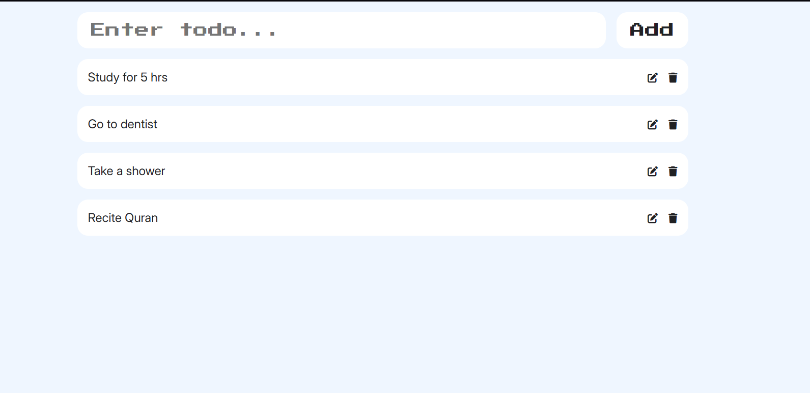

# 📝 React Todo List App

A simple and interactive Todo List app built with **React** and styled using **CSS**. It supports adding, editing, and deleting tasks, and stores data in **localStorage** so your tasks persist even after refreshing the browser!

---

## 📸 Screenshot
<p align="center">
  
</p>

---

## 🔧 Features

- ✅ Add new todos
- 🗑️ Delete existing todos
- ✏️ Edit a todo item
- 💾 Persistent storage using `localStorage`
- ⚛️ Built with functional components and React hooks (`useState`, `useEffect`)
- 🧩 Modular code (separated into components like `TodoInput`, `TodoList`, `TodoCard`)

---

## 📁 Project Structure

```
src/
│
├── App.jsx              # Main app logic and state handling
├── components/
│   ├── TodoInput.jsx    # Input field and add button
│   ├── TodoList.jsx     # Maps todos to individual cards
│   └── TodoCard.jsx     # Displays a single todo item with edit/delete
├── index.css            # Styling (optional)
└── main.jsx             # Renders the App
```

---

## 🚀 Getting Started

### Prerequisites
- Node.js installed
- npm or yarn

### Installation

```bash
git clone https://github.com/your-username/react-todo-list.git
cd react-todo-list
npm install
npm run dev
```

---

## 🌐 Live Demo

🔗 [Visit Live App on Netlify](https://reactjs-todo-01.netlify.app)


---

## 📦 Technologies Used

- React
- JavaScript (ES6+)
- HTML5 & CSS3
- localStorage API
- Vite (for faster dev/build)

---

## 🧠 Concepts Covered

- React functional components
- State management with `useState`
- Side effects with `useEffect`
- Prop drilling and reusable components
- Immutable data updates
- Browser localStorage persistence

---

## 🧑‍💻 Author

**Haider Zia**  
Roll No: 22i-1196  
FAST University, Islamabad  
✨ Built with ❤️ using React

---

## 📜 License

This project is open-source and available under the [MIT License](LICENSE).
